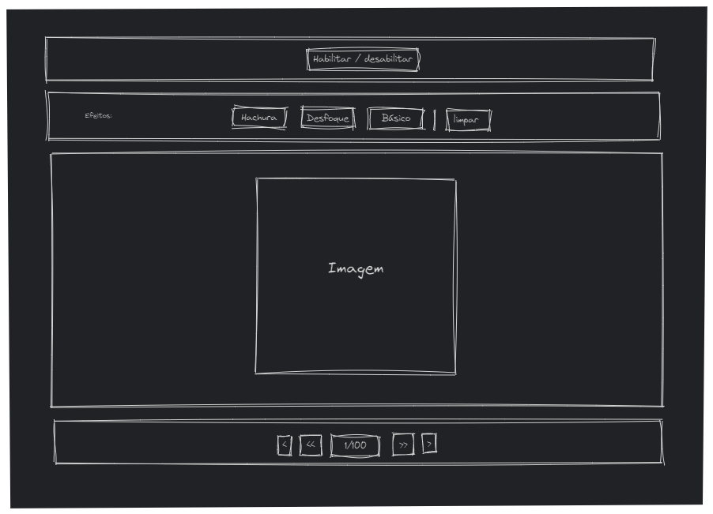

# Teste Técnico - Front End - Privacy Tools

## Descrição
Este projeto é um teste técnico para a vaga de Front End Pleno. O objetivo é demonstrar habilidades em HTML, CSS e JavaScript, desenvolvendo uma aplicação que permite adicionar retângulos com diferentes efeitos sobre uma imagem carregada a partir da API fornecida.

**Link para o projeto em produção:** [Teste Front Privacy Tools](https://alexandrefb.com/teste-frot-privacy-tools/)

Obs.: Qualquer problema, também está disponível no githubpages [Teste Front Privacy Tools](https://alexandre-fb.github.io/teste-front-privacy-tools/)

## Tecnologias Utilizadas
- HTML
- CSS
- JavaScript

## Como Executar o Projeto
1. Clone o repositório:
  ```bash
  https://github.com/alexandre-fb/teste-front-privacy-tools
  ```
2. Navegue até o diretório do projeto:
  ```bash
  cd teste-front-privacy-tools
  ```
3. Para rodar o projeto localmente, é necessário utilizar um servidor local, pois abrir o arquivo `index.html` diretamente no navegador pode causar problemas de CORS (Cross-Origin Resource Sharing) nas requisições HTTP. Se você estiver usando o Visual Studio Code, pode utilizar a extensão **Live Server** para facilitar esse processo:

  - **Instale a extensão Live Server:**
    - Abra o Visual Studio Code.
    - Vá para a aba de extensões (`Ctrl+Shift+X`).
    - Procure por "Live Server" e clique em "Install".

  - **Clique com o botão direito do mouse em cima da index.html e selecione "Open With Live Server"**

    - O navegador abrirá automaticamente a página em `http://localhost:5500`.

## Funcionalidades
- [x] **Carregamento de Imagens a partir da API Fornecida**: 
  - O projeto faz requisições HTTP para uma API externa para carregar imagens dinamicamente. As imagens são exibidas na interface do usuário conforme são carregadas.
- [x] **Paginação**: 
  - Implementação de um sistema de paginação que permite ao usuário navegar entre diferentes páginas de imagens. Inclui botões para avançar e retroceder páginas, além da capacidade de pular várias páginas de uma vez (de dez em dez páginas). Também é possível inserir diretamente o número da página de destino.
- [x] **Interatividade com JavaScript**: 
  - Utilização de JavaScript para adicionar interatividade à aplicação, incluindo a manipulação do DOM, eventos de clique, e atualização dinâmica do conteúdo da página.
- [x] **Desenho e remoção de Retângulos em cima da Imagem com Diferentes Efeitos**: 
  - Implementação de uma funcionalidade que permite ao usuário desenhar retângulos sobre a imagem carregada, aplicando diferentes efeitos visuais, como hachura, desfoque e cor.
- [x] **Armazenamento Local**: 
  - Utilização do `localStorage` para salvar o estado atual da página, permitindo que o usuário retorne à mesma página ao recarregar a aplicação.
- [x] **Tratamento de Erros**: 
  - Implementação de tratamento de erros para lidar com falhas na requisição de imagens e outros problemas potenciais, garantindo uma experiência de usuário mais robusta.
- [x] **Zoom**: 
  - Implementação de uma funcionalidade de zoom que permite ao usuário ampliar e reduzir a imagem carregada. Os objetos desenhados acompanham o zoom, mantendo suas proporções e posições relativas na imagem.

## Processo de Desenvolvimento

### Estrutura Inicial
Como o teste não contava com um layout definido, criei um breve rascunho da estrutura para me guiar:


### Organização dos Arquivos
Inicialmente, decidi separar os arquivos JavaScript em três módulos principais:
- **ImageFetcher**: Responsável por buscar e carregar as imagens a partir da API fornecida.
- **Pagination**: Gerencia a navegação entre diferentes páginas de imagens.
- **Drawer**: Manipula a tag `canvas` para desenhar os elementos gráficos.

### Refatoração para Programação Orientada a Objetos
Após desenvolver os primeiros dois módulos, senti a necessidade de organizar melhor a estrutura do código. Decidi então refatorar o projeto para usar Programação Orientada a Objetos. Essa mudança facilitou a comunicação entre as diferentes partes do projeto e tornou o código mais modular e reutilizável.

### Implementação das Classes
- **Drawer**: Classe principal responsável por manipular a tag `canvas` e desenhar os elementos gráficos.
- **Square**: Classe base para os desenhos de quadrados no canvas.
  - **SquareBlur**: Subclasse de `Square` que aplica um efeito de desfoque.
  - **SquareHachura**: Subclasse de `Square` que aplica um efeito de hachura.

### Evolução do Efeito de Hachura
Para o efeito de hachura, inicialmente usei uma imagem com um padrão (`pattern`) que era adicionada ao retângulo. Após testar, percebi que o resultado não era muito fluido. Pesquisei alternativas e consegui implementar o efeito de hachura diretamente no canvas, o que melhorou significativamente a performance e a aparência do efeito.

## Maiores Desafios

### Manutenção das Dimensões e Posicionamentos
Um dos maiores desafios foi a criação dos desenhos e a manutenção das dimensões e posicionamentos durante o zoom e ao redimensionar a página. Já tinha tido uma experiência prévia com a tag `<canvas>` em um curso de games 2D com JS que fiz recentemente, o que me ajudou bastante no processo.

### Estruturação com Programação Orientada a Objetos (POO)
Outro desafio grande foi estruturar a aplicação utilizando Programação Orientada a Objetos. Embora eu tivesse tido contato com esse paradigma durante as aulas da faculdade e alguns cursos, nunca havia trabalhado diretamente com ele em um projeto real. 

## O que Faltou

### Acesso à Quantidade de Páginas da API
Um dos pontos que não consegui finalizar como gostaria foi o acesso à quantidade de páginas através da API. Parece que essa informação não está disponível nos headers da resposta. Consegui visualizar a quantidade de páginas apenas na aba Network do DevTools e, por isso, tive que adicionar essa informação manualmente. Se fosse um projeto real, seria necessário conversar diretamente com a equipe de backend para verificar, entender e solucionar esse problema.

### Redimensionamento e Persistência dos Desenhos
Outro ponto que não ficou como eu gostaria é o comportamento dos desenhos ao redimensionar a tela e atualizar a página. Ao desenhar um retângulo em uma tela menor e redimensionar, ele se comporta bem. No entanto, se a página for atualizada em um tamanho diferente do que foi desenhado originalmente, o tamanho e o posicionamento dos desenhos são afetados. Por falta de tempo, não consegui implementar uma solução completa para esse problema. Minha abordagem seria salvar as dimensões iniciais dos desenhos no `localStorage` e, ao reiniciar em outra dimensão, comparar as duas e ajustar os desenhos conforme necessário.


Apesar desses pontos não finalizados, o projeto serviu como uma excelente oportunidade de aprendizado e desenvolvimento.

## Autor
Alexandre Foschiera Bisognin


